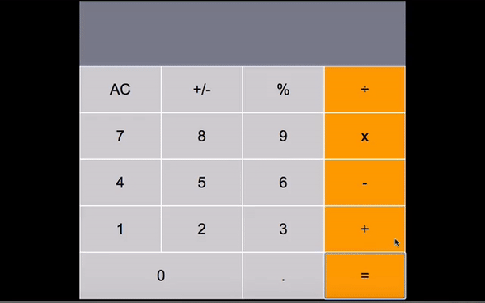

<h1 align="center">React Calculator</h1>

  

# :arrow_right: [Live Demo](https://calculator-react-julian.herokuapp.com/)

## Author

:man: Julian Belmonte

- Github: [@jucora](https://github.com/jucora)
- Twitter: [@Julian Belmonte](twitter.com/JulianBelmonte)
- Linkedin: [Julian Belmonte](linkedin.com/in/julianbel)

## :pencil: Main Description

This project consists of creating a calculator using the ReactJS open source JavaScript library, applying basic principles such as the use of components, destructuring, JSX, props, defaultProps, propTypes, among others. This project is part of the Microverse curriculum for the React course.

For more information about the project requirements, please follow the next link: [Microverse React Project - Calculator](https://github.com/microverseinc/project-react-calculator)

## How to install the App

1. Please clone the repository by running the next comand in your machine:

<pre><code>https://github.com/jucora/Calculator.git</code></pre>

2. Next, run the next command to install all project dependencies:

   For Yarn: <pre><code>yarn install</code></pre>
   For npm: <pre><code>npm install</code></pre>

## How to run the app locally

1. Get into the folder of the project by running the next command:

<pre><code>cd react-calculator</code></pre>

2. Start your local server by running the next command:

   For Yarn: <pre><code>yarn start</code></pre>
   For npm: <pre><code>npm start</code></pre>

## :computer: Library, Languages and technologies

- Create React App
- React
- React-DOM
- JSX
- CSS
- Node.js
- big.js
- prop-types
- npm

## Report Issues

Please feel free to make a contribution, report any issue, feature request or provide any feedback. Click [here](https://github.com/jucora/Calculator/issues)

## Support

Feel free to drop a like, that would support me a lot.
